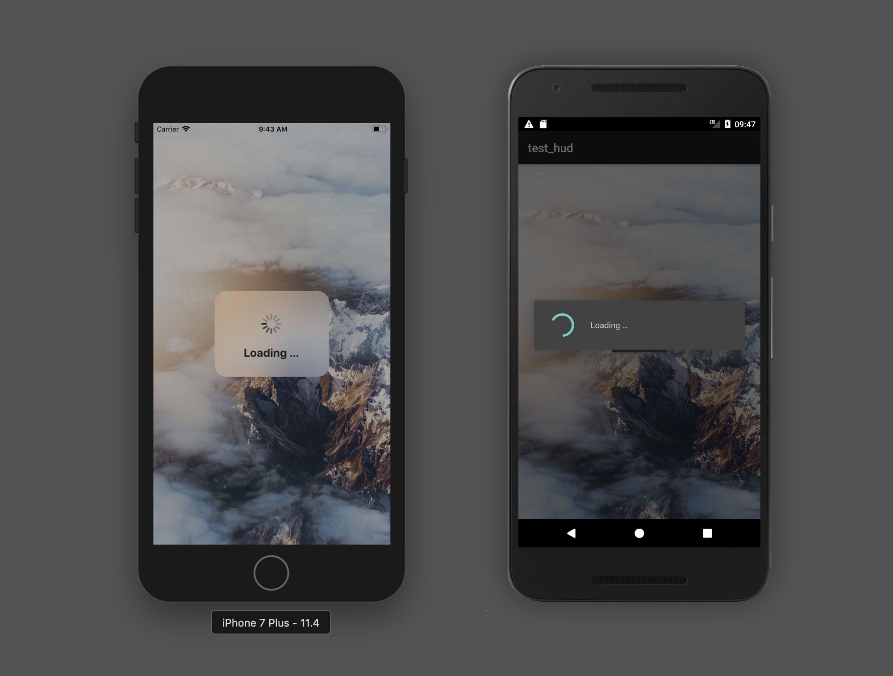

# Titanium Loading HUD-Control

A simple loading HUD that uses native UI elements to present
a modal loading indicator.



## Requirements

- Titanium SDK 7.1.0+
- ES6 enabled (`<transpile>true</transpile`)

## Install

- a) Simply put the `loader.js` into `app/lib` (Alloy) or `Resources` (Classic).
- b) Install via npm: `npm i titanium-loading-hud`

## Example

```js
import Loader from 'loader';

const loader = new Loader({
  view: $.window,
  title: 'Loading …',
});

loader.show();

setTimeout(() => {
  loader.hide();
}, 2000);
```

## License

MIT

## Author 

Hans Knöchel
